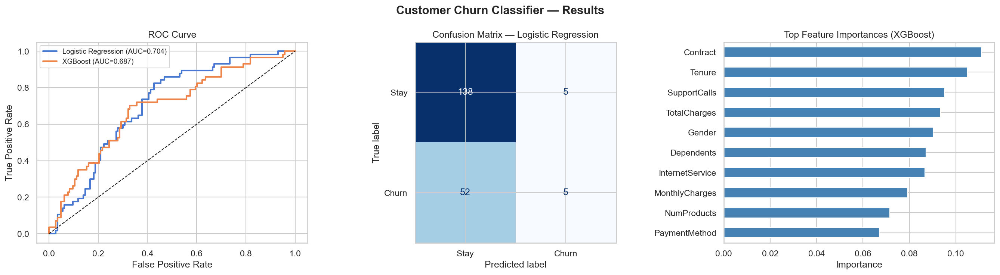

# 📉 Customer Churn Classifier

> Predict which customers are likely to cancel — before they do.

A complete binary classification pipeline using **Logistic Regression** and **XGBoost**,
with data generation, model evaluation, and inference. Built as a practical ML portfolio project.

---

## 🧠 Business Problem

Customer churn costs subscription businesses millions. Acquiring a new customer costs
5–7x more than keeping an existing one. This model predicts churn probability per customer
so retention teams can intervene early with offers or outreach.

---

## 📊 Results

| Model               | Test AUC | CV AUC (5-fold) |
|---------------------|----------|-----------------|
| Logistic Regression | 0.704    | 0.675           |
| XGBoost             | 0.687    | 0.691           |

---

## 🗂️ Project Structure